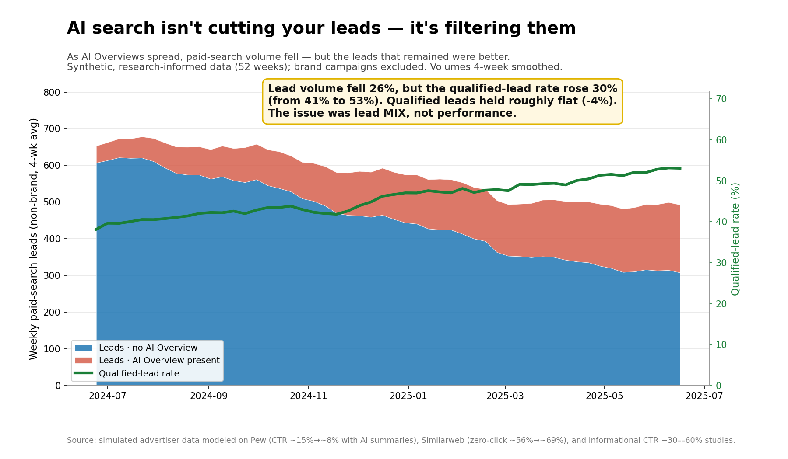

# AI Search Isn't Cutting Your Leads — It's Filtering Them

*Paid search in the answer-engine era: a synthetic, research-informed analysis.*

When AI Overviews and AI Mode eat into organic and informational click-through,
paid-search lead volume starts falling too. The reflex is to cut the program.
This project argues the reflex is wrong: in a research-informed simulation, raw
leads fell **~26%** while the **qualified-lead rate rose ~30%** and qualified
leads held roughly flat. AI search didn't break paid search — it **filtered out
the cheap, low-intent clicks** that were never going to convert. The problem was
lead **mix**, not performance.



---

## Business question

> As AI search reduces informational click-through and total paid-search leads
> decline, should a growth team **cut** the paid-search program — or is the real
> story a **shift in lead mix** that calls for **reallocation** instead?

## Stakeholder & decision

- **Audience:** Head of Growth / Demand Generation (and the CFO who sees "leads
  are down" on a dashboard).
- **Decision on the table:** for next quarter's budget — **cut**, hold, or
  **reallocate** paid search.
- **Why now:** Google is shifting from a *traffic engine* to an *answer engine*,
  and ads are moving **into** AI Overviews / AI Mode (plus AI Max for Search). A
  dashboard that tracks raw leads will give exactly the wrong signal.

## Data sources & limitations

**The dataset is synthetic — generated by `data/generate_data.py` with a fixed
random seed (42).** No clean, public, advertiser-level dataset exists that ties
AI-Overview presence to paid-search lead quality, so building an honest
simulation is the responsible move. The dynamics are *research-informed*,
anchored to published figures:

| Signal modeled | Public anchor |
| --- | --- |
| Result CTR roughly halves (~15% → ~8%) when an AI summary is present | Pew Research, ~68k queries |
| Zero-click searches rose ~56% → ~69% in about a year | Similarweb |
| Informational-query CTR down ~30–60% | Multiple SEO/SEM studies |
| Ads moving *into* AI Overviews / AI Mode; AI Max for Search | Google announcements |

**Limitation, stated plainly:** these are not real advertiser numbers, and the
exact percentages should not be quoted as fact. The contribution here is the
*analytical model and the decision it leads to*, reproducible end-to-end. Treat
the magnitudes as illustrative, the **direction and method** as the point.

## Cleaning decisions

These are the judgment calls a hiring manager actually wants to see documented.
All are enforced in `src/analysis.py` (and baked into the generator where noted).

1. **What counts as a "qualified" lead.** A qualified lead is the subset of
   leads that clear a fit-and-intent bar (think MQL → SQL hand-off). In the
   model, `qualified_leads` is a *rate applied to leads* that depends on
   `query_intent` and `landing_page_type`: transactional/commercial intent on
   proof-style pages (demo, calculator, comparison, case study) qualify far
   better than informational intent on generic pages. This is why the
   qualified-lead *rate* can rise even as raw leads fall.
2. **Zero-spend / zero-click weeks.** Rate metrics (CTR, CPC, CPL, CPQL, CAC,
   ROAS) are computed with a `safe_div` that returns **NaN — never 0 or inf —**
   on a zero denominator, so a paused, zero-click week is *excluded* from rate
   averages rather than silently poisoning them. Volume sums still include the
   week. The data deliberately contains a 4-week Q3 **budget freeze** so this
   path is exercised (8 zero-click / 8 zero-spend rows).
3. **Brand vs non-brand.** Branded queries are isolated (`is_branded`) and
   **excluded from the erosion analysis**. Branded demand is largely insulated
   from AI Overviews; leaving it in would mask the informational story. Brand is
   reported separately as a control, not mixed into the headline.
4. **Smoothing & outliers.** Trend **visuals** use a 4-week rolling average so
   weekly noise doesn't distort the eye; **totals and statistics use raw weekly
   values**. Headline deltas compare the **first 8 weeks vs the last 8 weeks**
   (noise-robust endpoints) rather than single cherry-picked weeks. No
   winsorizing — simulated extremes are kept and disclosed.
5. **Simulation assumptions (honest list).** Seed = 42; 52 weekly periods × 8
   campaigns × {AI present / not} = 832 rows. AI-Overview penetration ramps over
   the year, fastest for informational (≈20% → 85%); informational ad-CTR is
   suppressed most under AI and also erodes at baseline; commercial/transactional
   stay resilient; CPC inflates as click volume falls; the lead→qualified rate
   improves ~10% over the year on remaining traffic. All magnitudes are anchored
   to the research ranges above, not to any real account.

## Analysis

Run `python src/analysis.py` to reproduce every number below.

**Step 1 — The alarm.** Total non-brand paid-search leads fell from **~662 to
~489 per week (−26%)**. On a raw-volume dashboard this looks like a failing
program.

**Step 2 — Where the drop lives.** The decline is **concentrated in
informational queries**, and the mechanism is AI Overviews:

| Segment | First 8 wks | Last 8 wks | Change |
| --- | ---: | ---: | ---: |
| Informational leads/wk | 212 | 86 | **−60%** |
| Commercial leads/wk | 277 | 241 | −13% |
| Transactional leads/wk | 172 | 163 | −6% |

Lead **yield** (leads per 1,000 impressions) when an AI Overview is present vs
not: informational **−59%**, commercial −15%, transactional −9%. Meanwhile the
share of informational impressions sitting **behind an AI Overview rose from
~24% to ~81%**. The traffic that collapsed was the low-intent traffic AI answers
best on its own.

**Step 3 — The twist.** The leads that remain are *better*:

- Qualified-lead rate: **40.6% → 52.6% (+30%)**
- Qualified leads: ~268 → ~257 per week (**−4%, essentially flat**)
- Revenue per visitor: **\$10.56 → \$17.94 (+70%)**

**Step 4 — Business impact (last 8-week run rate).**

- Cost per qualified lead: **informational \$958** vs **commercial-intent \$152**
  (informational qualified leads cost ~6× more).
- **Cut the whole program →** forfeit ~**13,400 qualified leads** and
  ~**\$10.1M revenue** per year (including the healthy commercial-intent engine).
- **Reallocate** (move 70% of informational spend into commercial-intent at its
  current efficiency, keep 30% for discovery) → at **equal spend**, net
  **+~1,700 qualified leads** and **+~\$1.3M revenue** per year.

## Hero chart

`charts/hero_chart.png` (above) — weekly non-brand paid-search leads, stacked by
whether an AI Overview was present, with the qualified-lead-rate line overlaid.
As the blue "no AI Overview" base shrinks and the red "AI present" band grows,
**total lead volume falls but the green quality line climbs**. Callout:
*"Lead volume fell 26%, but the qualified-lead rate rose 30%. The issue was lead
MIX, not performance."*

## Recommendation

**Do not cut paid search, and do not just buy more broad traffic.** Reallocate.

1. **Shift budget from informational to commercial/transactional intent.**
   Informational clicks are what AI answers for free; commercial-intent clicks
   are where buyers still come to you. The CPQL gap (\$958 vs \$152) makes this
   the highest-leverage move.
2. **Rebuild landing pages around proof, not pages around traffic** — comparison
   pages, ROI/calculator tools, demos, case studies. These convert and *qualify*
   far better than generic informational pages.
3. **Change the scoreboard.** Manage to **qualified-lead rate** and **revenue
   per visitor**, not raw leads or clicks. The raw-lead dashboard is the thing
   that nearly triggered a value-destroying cut.

In an answer-engine world, the goal isn't to win the clicks AI is taking — it's
to win the visitors who still have a reason to click.

## Skills demonstrated

- Framing a fuzzy business question into a decision (cut vs hold vs reallocate)
- Research-informed **synthetic data modeling** with documented assumptions
- **pandas** metric engineering (CTR, CPC, CVR, CPL, CPQL, qualified-lead rate,
  CAC, ROAS, revenue per visitor) with robust zero-denominator handling
- Segmentation & **decomposition** (concentration + mechanism, not just totals)
- **Business-impact scenario modeling** (cut vs reallocate at equal spend)
- **Data-viz storytelling** — one decisive hero chart over many default plots
- Analytical writing for a non-technical leader (`decision_memo.md`)

## How to reproduce

```bash
# 1. install (Python 3.12 recommended)
pip install -r requirements.txt

# 2. generate the synthetic dataset -> data/marketing_data.csv
python data/generate_data.py

# 3. run the analysis -> console report + charts/hero_chart.png
python src/analysis.py
```

Prefer a narrative walk-through? Open `notebooks/analysis.ipynb`. A 2-minute
leadership summary lives in `decision_memo.md`.

## Repo structure

```
ai-search-paid-search/
├── data/
│   ├── generate_data.py      # seeded synthetic data generator
│   └── marketing_data.csv     # generated (committed for convenience)
├── src/
│   └── analysis.py            # cleaning, metrics, 4-step analysis, hero chart
├── notebooks/
│   └── analysis.ipynb         # narrative version of the analysis
├── charts/
│   └── hero_chart.png         # the single decisive chart
├── decision_memo.md           # 1-page summary for a marketing leader
├── requirements.txt
└── README.md
```

> Data is synthetic and research-informed. Figures are illustrative of the
> method and the decision, not real advertiser results.
